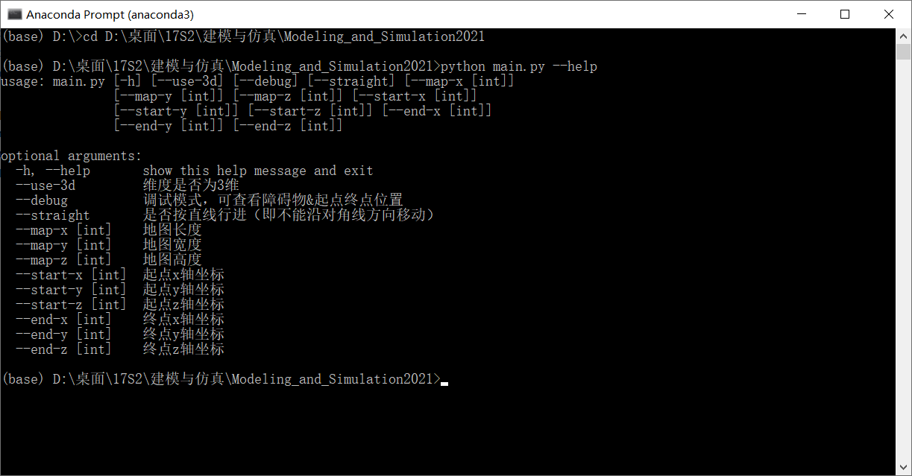
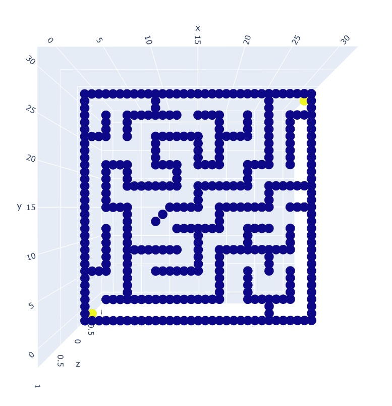
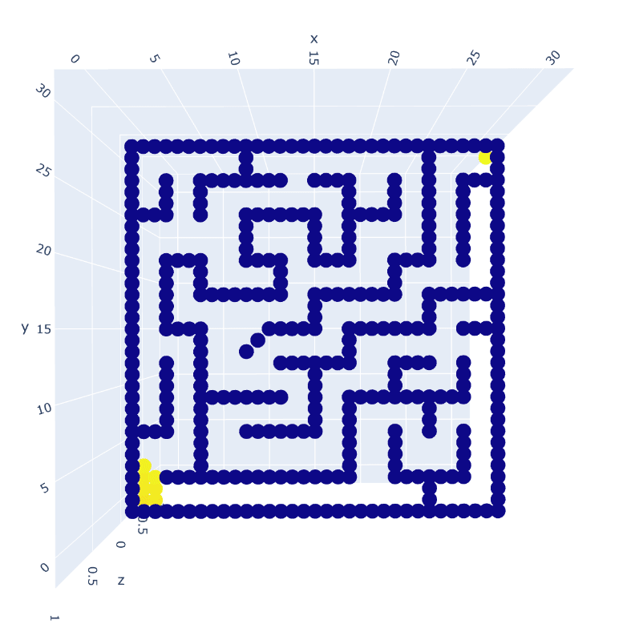
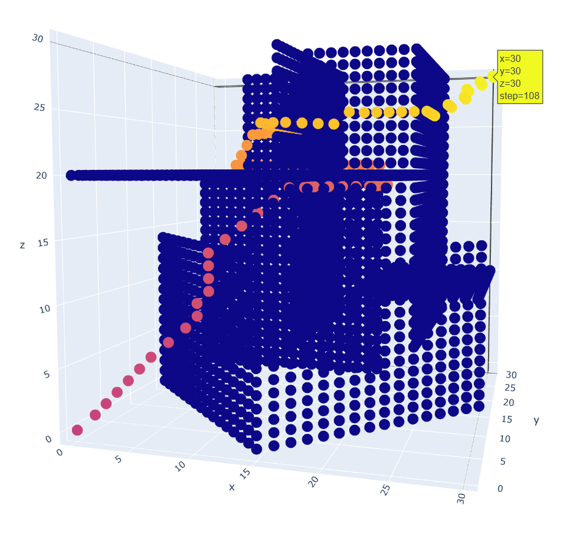
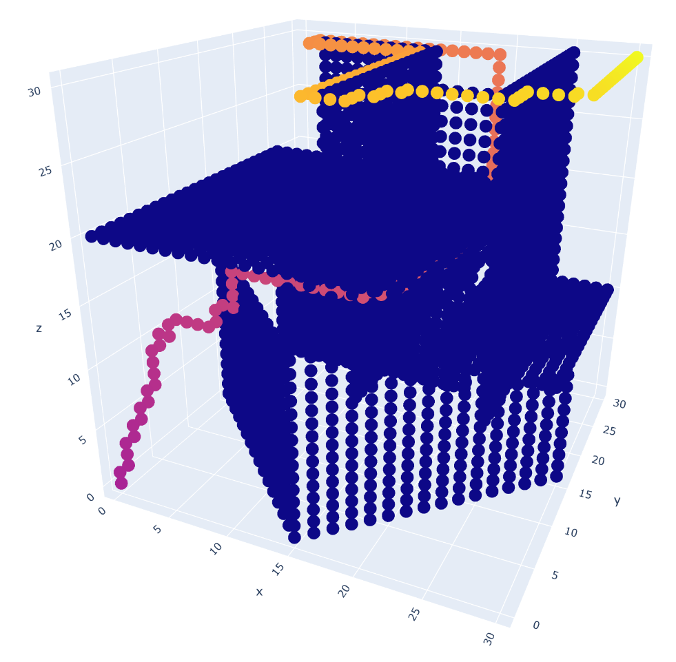
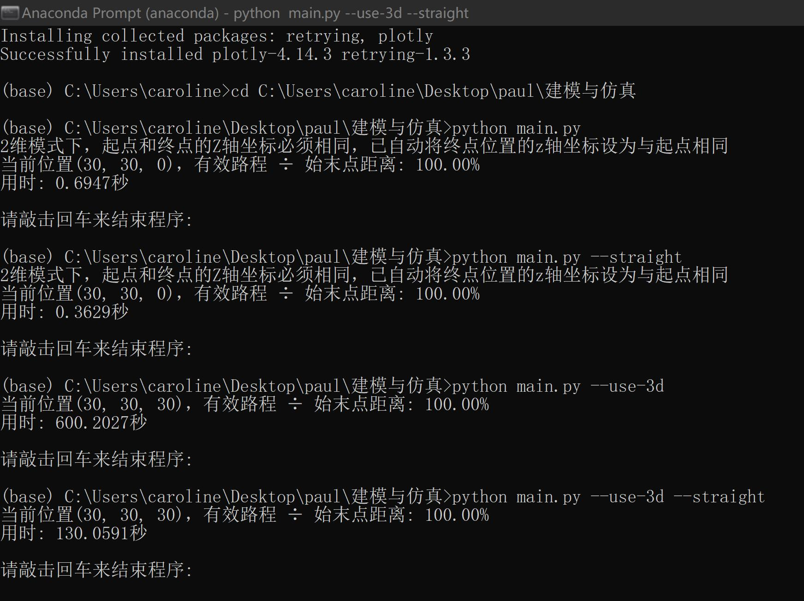

# 使用A*算法的最短路径优化设计

> 2021.4 - 2021.6 建模与仿真

**使用python实现**

**Author: GitHub@laorange**

**开源授权协议: AGPL-3.0 License**

[源代码](https://github.com/laorange/Modeling_and_Simulation2021/blob/main/main.py)、[更新日志](https://github.com/laorange/Modeling_and_Simulation2021/blob/main/README.md)、[GitHub](https://github.com/laorange/Modeling_and_Simulation2021)、[Gitee](https://gitee.com/laorange/Modeling_and_Simulation2021)

## 使用说明

1. 打开命令行``cmd`` 或 ``Anaconda Prompt``

2. ``cd`` 转到程序所在的文件夹下

3. 安装所需第三方库

   ```txt
   pip install pandas
   pip install plotly
   ```
   
4. 输入 ``python main.py --help`` 可查看所有可选参数的说明

5. 示例：

   

> **备注**：默认是沿对角线方向移动(2d为8向, 3d为26向)；如果是传入``--straight``参数则使用直线模式：2d为前后左右4个方向（3d为前后左右上下6个方向）

## 示例

### 2d情况

#### 对角线模式：(用时: 0.6947秒) 



#### 直线模式：(用时: 0.3629秒)



-----

### 3d情况

```python
# 以下情况为障碍物
if x - y == 15 and z < 15:
    OBSTACLE = True
if x - y == 15 and 15 <= z <= 20 and x <= 25:
    OBSTACLE = True
if x == 25 and z > 5 and y >= 10:
    OBSTACLE = True
if z == 20 and y < 25 and x <= 25:
    OBSTACLE = True
if z == 10 and y > 10 and x >= 20:
    OBSTACLE = True
if y == 25 and x < 20 and z <= 20:
    OBSTACLE = True
if y == 25 and 5 <= x <= 15 and z >= 20:
    OBSTACLE = True
if y == 10 and 15 <= x <= 25 and z >= 20:
    OBSTACLE = True
if x == 15 and 10 <= y < 25 and z > 5:
    OBSTACLE = True
if x == 15 and 5 <= y < 10 and z > 20:
    OBSTACLE = True
if x + y == 15 and z < 15:
    OBSTACLE = True
```

#### 对角线模式：(用时: 600.2027秒)

原文件请在 ``results/v1静态结果示例.zip`` 中查看



#### 直线模式：(用时: 130.0591秒)

原文件请在 ``results/v1静态结果示例.zip`` 中查看



-------

## 总截图


