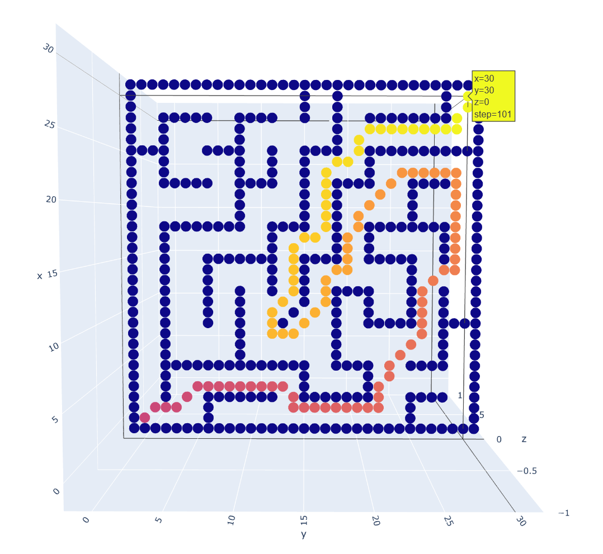
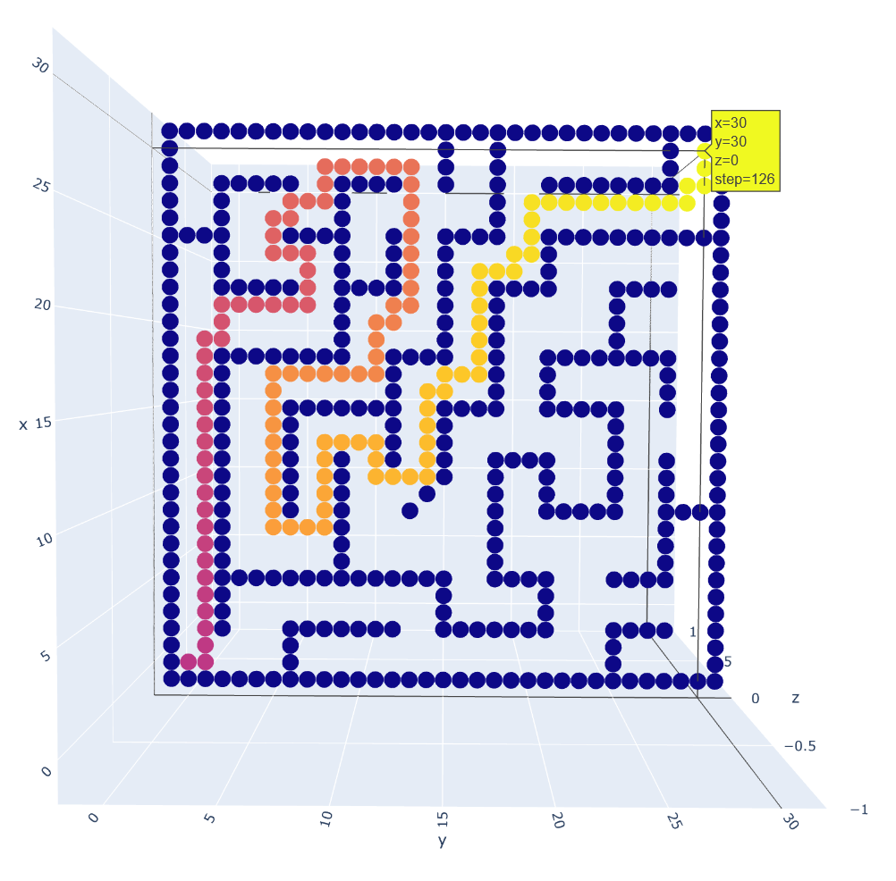

Modeling_and_Simulation2021

# 使用A*算法的最短路径优化设计

> 2021.4 建模与仿真

**使用python实现**

**Author: GitHub@laorange**

**开源授权协议: AGPL-3.0 License**

[源代码](https://github.com/laorange/Modeling_and_Simulation2021/blob/main/main.py)、[更新日志](https://github.com/laorange/Modeling_and_Simulation2021/blob/main/log.md)、[GitHub](https://github.com/laorange/Modeling_and_Simulation2021)、[Gitee](https://gitee.com/laorange/Modeling_and_Simulation2021)

## 使用说明

1. 打开命令行``cmd`` 或 ``Anaconda Prompt``

2. ``cd`` 转到程序所在的文件夹下

3. 安装所需第三方库

   ```txt
   pip install pandas
   pip install plotly
   ```
   
4. 输入 ``python main.py --help`` 可查看所有可选参数的说明

5. 示例：

   

> **备注**：默认是沿对角线方向移动(2d为8向, 3d为26向)；如果是传入``--straight``参数则使用直线模式：2d为前后左右4个方向（3d为前后左右上下6个方向）

## 示例

### 2d情况

```python
# 以下情况为障碍物
if x == 2 and y in [2, 6, 7, 8, 9, 10, 11, 12, 15, 16, 17, 18, 19, 20, 21, 25, 26, 27, 28]:
    OBSTACLE = True
if x == 5 and y in [3, 4, 5, 6, 7, 8, 9, 10, 11, 12, 13, 14, 15, 18, 19, 20, 21, 25, 26, 27, 28]:
    OBSTACLE = True
if x == 9 and y in [2, 6, 9, 13, 18, 21, 22, 23, 24, 25, 28, 29, 30]:
    OBSTACLE = True
if x == 10 and y == 14:
    OBSTACLE = True
if x == 12 and y in [9, 12, 15, 18, 19, 20, 21, 25]:
    OBSTACLE = True
if x == 15 and y in [2, 6, 7, 8, 9, 10, 11, 12, 15, 16, 17, 18, 21, 22, 23, 24, 25, 28]:
    OBSTACLE = True
if x == 18 and y in [2, 3, 4, 5, 6, 7, 8, 9, 12, 13, 14, 15, 18, 21, 22, 23, 24, 25, 26, 27, 28]:
    OBSTACLE = True
if x == 22 and y in [2, 3, 4, 5, 6, 9, 10, 11, 12, 15, 18, 19, 20, 21, 25, 26, 27, 28]:
    OBSTACLE = True
if x == 25 and y in [0, 1, 2, 6, 7, 8, 9, 12, 15, 16, 17, 18, 21, 22, 23, 24, 25, 26, 27, 28, 29, 30]:
    OBSTACLE = True
if x == 28 and y in [2, 3, 4, 5, 6, 9, 10, 11, 12, 15, 18, 21, 22, 23, 24, 25, 26, 27, 28]:
    OBSTACLE = True
if y == 2 and x in [3, 4, 5, 6, 7, 8, 10, 11, 12, 13, 14, 15, 16, 17, 18, 22, 23, 24, 25, 26, 27, 28]:
    OBSTACLE = True
if y == 6 and x in [0, 1, 2, 5, 9, 10, 11, 12, 13, 14, 15, 18]:
    OBSTACLE = True
if y == 9 and x in [6, 7, 8, 9, 10, 11, 12, 19, 20, 21, 23, 24, 26, 27, 28]:
    OBSTACLE = True
if y == 12 and x in [13, 14, 15, 16, 17, 22, 23, 24, 25]:
    OBSTACLE = True
if y == 15 and x in [3, 4, 11, 12, 13, 14, 19, 20, 21, 22, 23, 24, 28, 29, 30]:
    OBSTACLE = True
if y == 18 and x in [6, 7, 8, 10, 11, 12, 16, 17, 18, 19, 20, 21, 22, 26, 27, 28, 29, 30]:
    OBSTACLE = True
if y == 21 and x in [3, 4, 10, 11, 16, 17, 18, 22, 23, 24]:
    OBSTACLE = True
if y == 25 and x in [0, 1, 10, 11, 12, 13, 14, 19, 20, 21, 22]:
    OBSTACLE = True
if y == 28 and x in [6, 7, 8, 10, 11, 12, 15, 16, 17, 18, 22, 25, 29, 30]:
    OBSTACLE = True
```

#### 对角线模式：(用时: 0.6947秒)

路径图：https://laorange.github.io/Modeling_and_Simulation2021/results/2dor.html

迭代图：https://laorange.github.io/Modeling_and_Simulation2021/results/2dos.html

截图：



#### 直线模式：(用时: 0.3629秒)

路径图：https://laorange.github.io/Modeling_and_Simulation2021/results/2dsr.html

迭代图：https://laorange.github.io/Modeling_and_Simulation2021/results/2dss.html

截图：



-----

### 3d情况

```python
# 以下情况为障碍物
if x - y == 15 and z < 15:
    OBSTACLE = True
if x - y == 15 and 15 <= z <= 20 and x <= 25:
    OBSTACLE = True
if x == 25 and z > 5 and y >= 10:
    OBSTACLE = True
if z == 20 and y < 25 and x <= 25:
    OBSTACLE = True
if z == 10 and y > 10 and x >= 20:
    OBSTACLE = True
if y == 25 and x < 20 and z <= 20:
    OBSTACLE = True
if y == 25 and 5 <= x <= 15 and z >= 20:
    OBSTACLE = True
if y == 10 and 15 <= x <= 25 and z >= 20:
    OBSTACLE = True
if x == 15 and 10 <= y < 25 and z > 5:
    OBSTACLE = True
if x == 15 and 5 <= y < 10 and z > 20:
    OBSTACLE = True
if x + y == 15 and z < 15:
    OBSTACLE = True
```

#### 对角线模式：(用时: 600.2027秒)

路径图：https://laorange.github.io/Modeling_and_Simulation2021/results/3dor.html

迭代图：https://laorange.github.io/Modeling_and_Simulation2021/results/3dos.html

截图：


#### 直线模式：(用时: 130.0591秒)

路径图：https://laorange.github.io/Modeling_and_Simulation2021/results/3dsr.html

迭代图：https://laorange.github.io/Modeling_and_Simulation2021/results/3dss.html

截图：


-------

## 总截图


