Modeling_and_Simulation2021

# 使用A*算法的最短路径优化设计

> 2021.4 建模与仿真

**使用python实现**

**Author: GitHub@laorange**

**开源授权协议: AGPL-3.0 License**

> 可选择沿对角线方向移动(2d变为8向, 3d变为26向)，但在以下示例中未开启该选项，2d为前后左右4个方向（3d为前后左右上下6个方向）

源代码：[main.py](https://github.com/laorange/Modeling_and_Simulation2021/blob/main/main.py)

更新日志：[log.md](https://github.com/laorange/Modeling_and_Simulation2021/blob/main/log.md)

## 使用说明

1. 打开命令行``cmd`` 或 ``Anaconda Prompt``

2. 转到程序所在的文件夹下

3. 安装所需第三方库

   ```
   pip install pandas
   pip install plotly
   ```

4. 输入``python main.py -h``可查看所有参数的说明

5. 示例：

   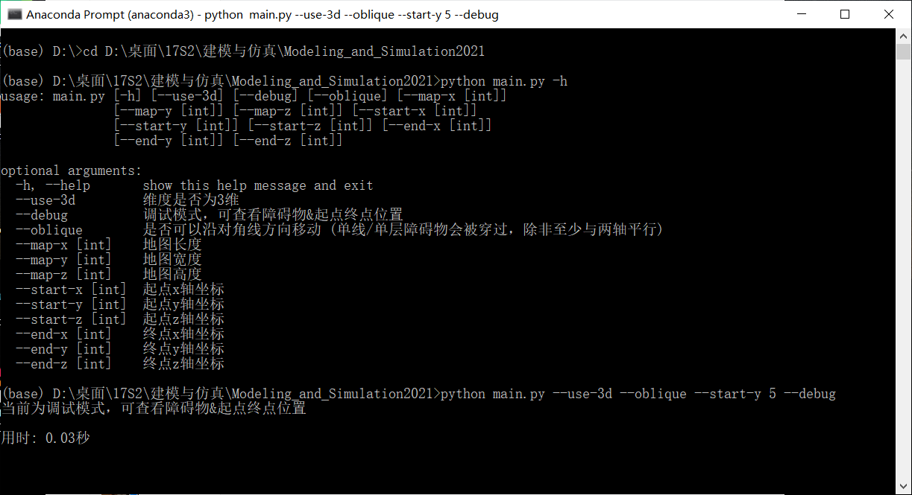

## 结果

**地图大小 100 × 100**

### 2维情况

(0, 0) → (80, 80) : 用时 43.03秒

#### 障碍物布局

```python
if x > 10 and y == 50 - x:
    OBSTACLE = True
if x < 50 and y == 60 - x:
    OBSTACLE = True
if x > 40 and y == 70 - x:
    OBSTACLE = True
if x == 50 and y > 40:
    OBSTACLE = True
if x == 40 and 30 <= y < 80:
    OBSTACLE = True
if 60 <= x <= 70 and y == 120 - x:
    OBSTACLE = True
if 50 <= x <= 70 and y == 140 - x:
    OBSTACLE = True
if x == 70 and 50 <= y <= 70:
    OBSTACLE = True
```

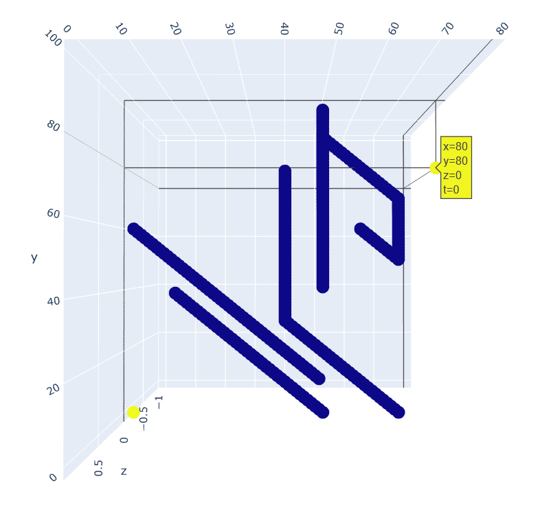

#### 路径图

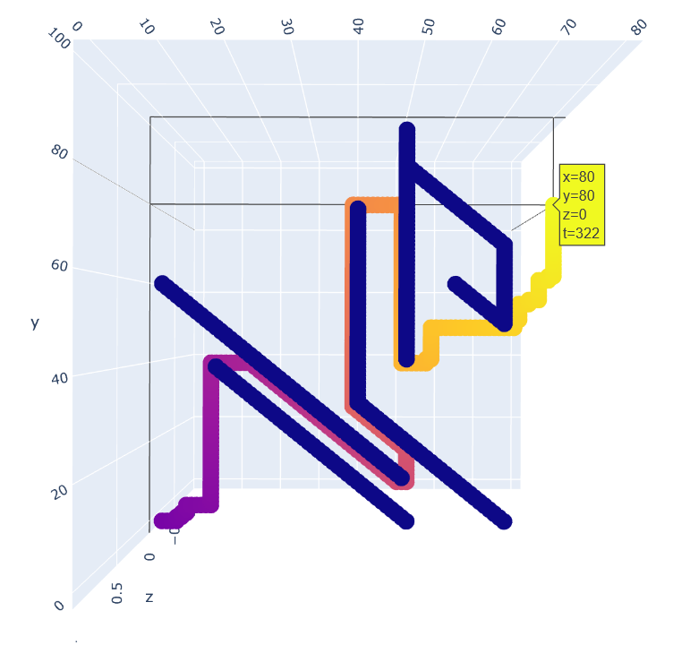

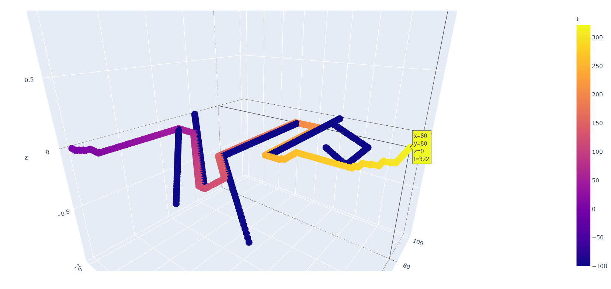

#### 迭代过程图

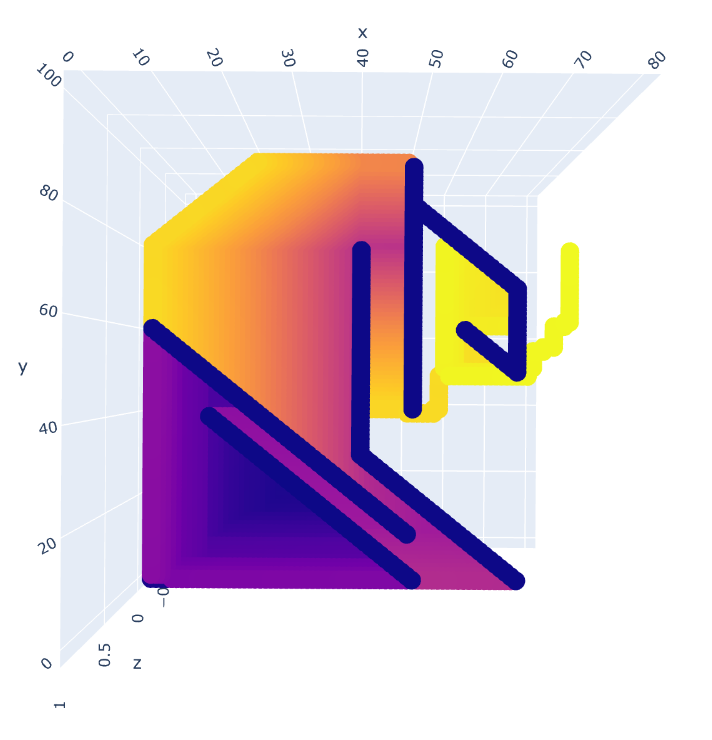

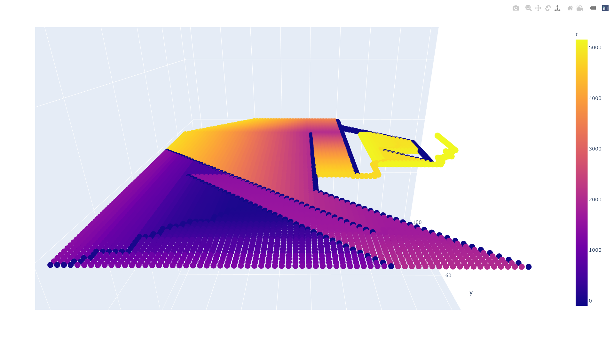

### 3维情况

(0, 0, 0) → (80, 80, 80) : 用时 532.22秒

#### 障碍物布局

```python
if y == 20 - x and z < 60:
    OBSTACLE = True
if y == 60 - x and 70 <= z <= 90:
    OBSTACLE = True
if x + y + z == 160 and 40 <= x <= 60 and 40 <= y <= 60 and 40 <= z <= 80:
    OBSTACLE = True
```

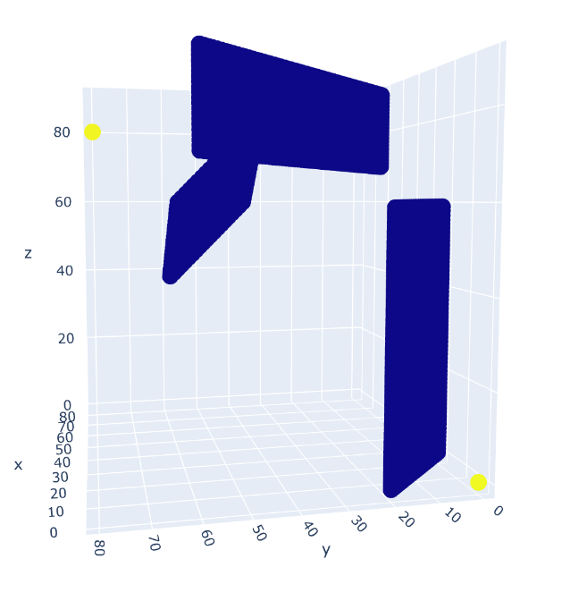

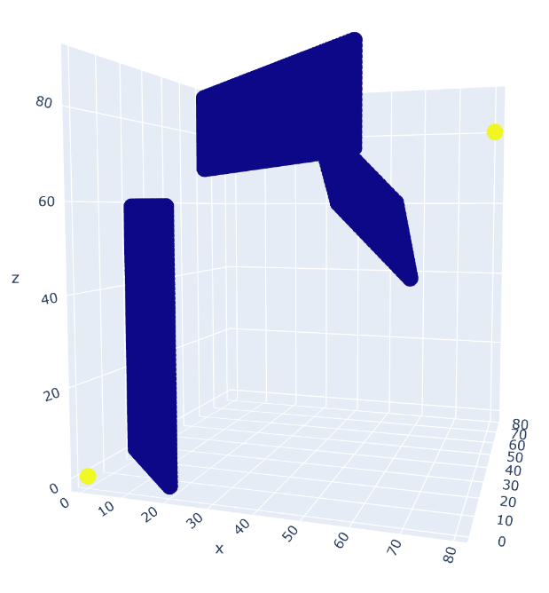

#### 路径图


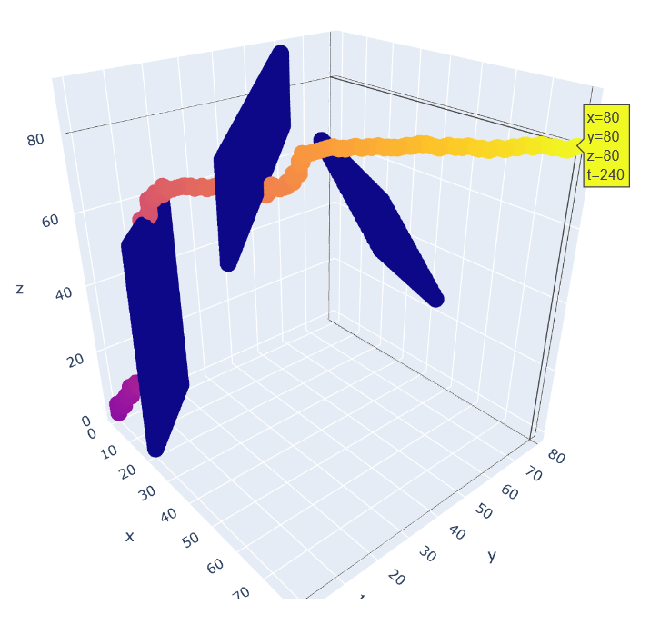

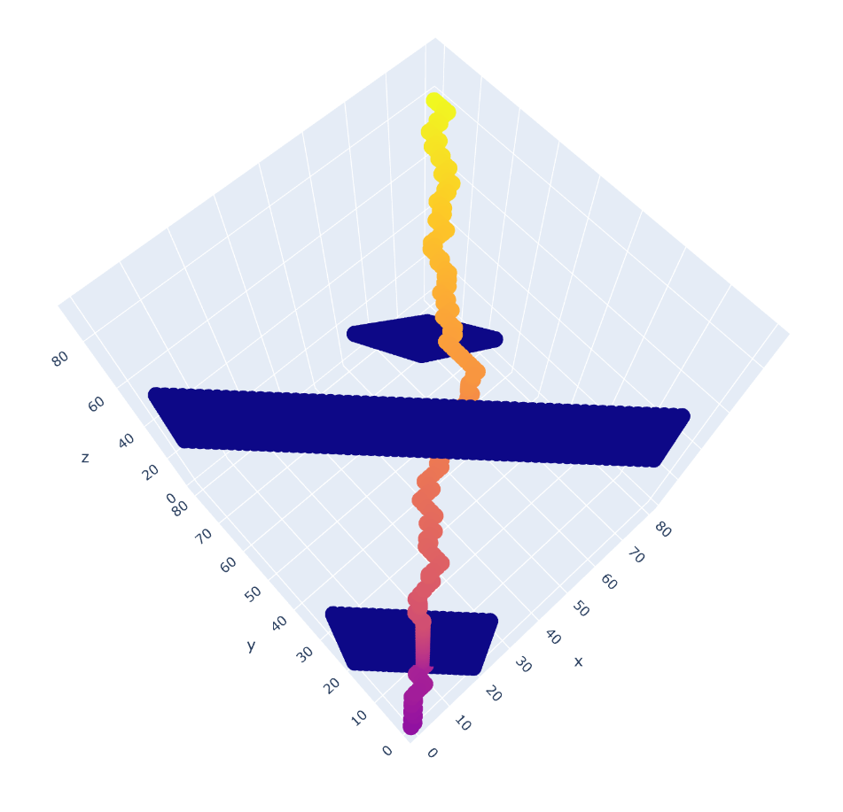

#### 迭代过程图


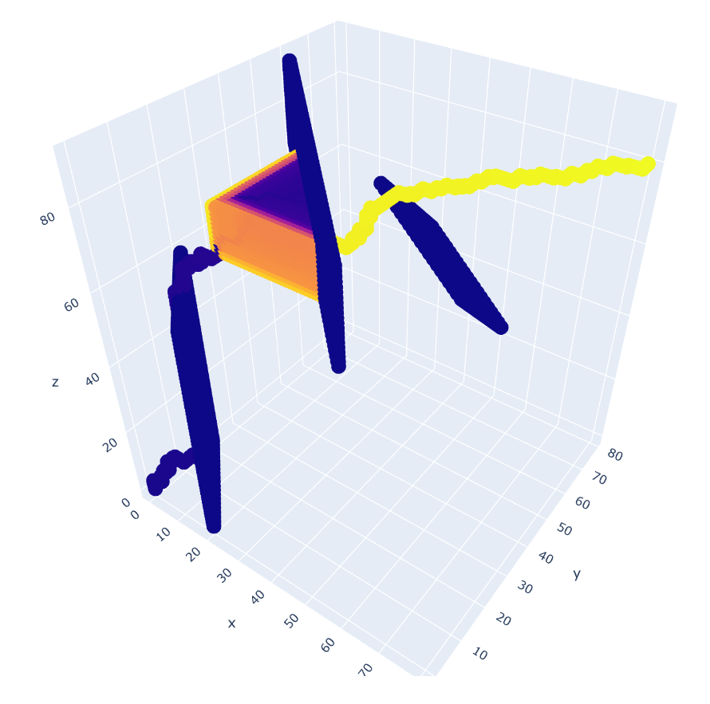

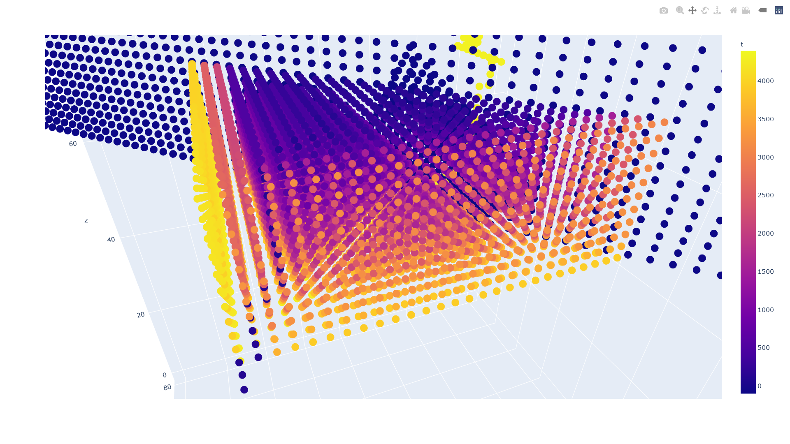

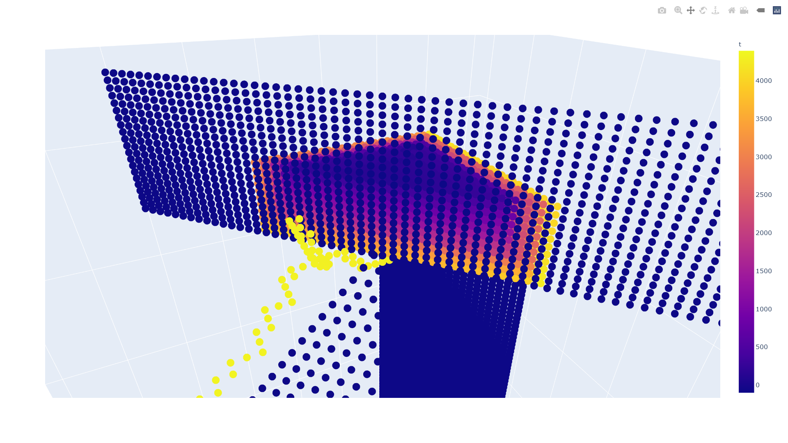

## 其他说明

v1.7以后，地图默认大小改为20×20

下图的识别仅需0.15秒

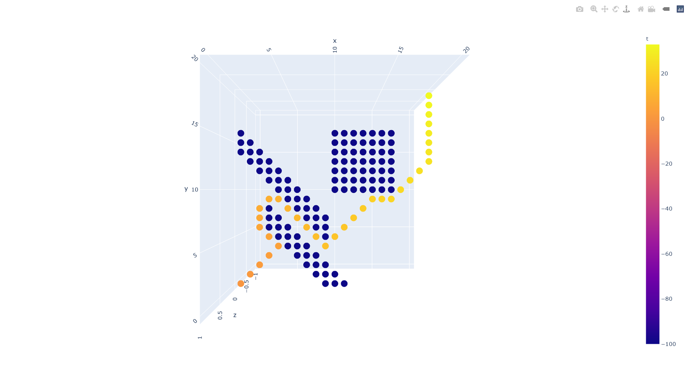