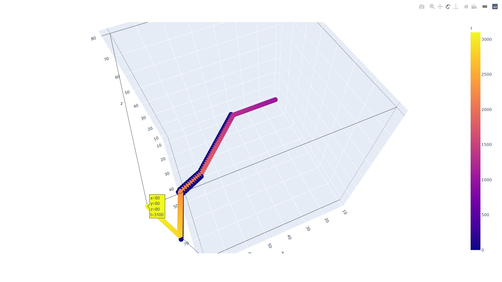
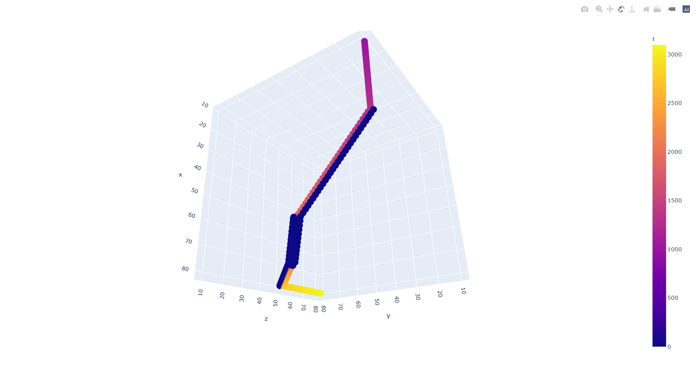

# Modeling_and_Simulation2021

## 2021.4 建模与仿真 - 使用A*算法的最短路径优化设计

**使用python实现**

**Author: GitHub@laorange**

**开源授权协议: AGPL-3.0 License**

示例中，

+ 地图大小为 100 × 100 × 100
+ 起点为 (10, 10, 10)
+ 终点为 (80, 80, 80)

+ 障碍物设置为

```python
    if y < x - 30 or z < y - 30 or x < z - 30:
        print("这是障碍物")
```

+ 效果图：






> 以上图片为浏览器打开demo.html的截图

