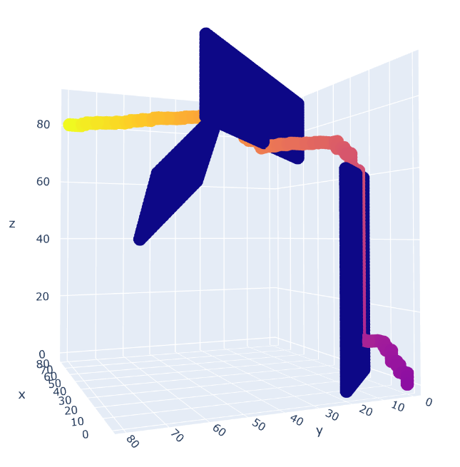

Modeling_and_Simulation2021

# 使用A*算法的最短路径优化设计

> 2021.4 建模与仿真

**使用python实现**

**Author: GitHub@laorange**

**开源授权协议: AGPL-3.0 License**

> 可选择沿对角线方向移动(2d变为8向, 3d变为26向)，但在以下示例中未开启该选项，2d为前后左右4个方向（3d为前后左右上下6个方向）

## 2维情况

(0, 0) → (80, 80) : 用时 43.03秒

### 障碍物布局

```python
if x > 10 and y == 50 - x:
    OBSTACLE = True
if x < 50 and y == 60 - x:
    OBSTACLE = True
if x > 40 and y == 70 - x:
    OBSTACLE = True
if x == 50 and y > 40:
    OBSTACLE = True
if x == 40 and 30 <= y < 80:
    OBSTACLE = True
if 60 <= x <= 70 and y == 120 - x:
    OBSTACLE = True
if 50 <= x <= 70 and y == 140 - x:
    OBSTACLE = True
if x == 70 and 50 <= y <= 70:
    OBSTACLE = True
```


### 路径图


### 迭代过程图


## 3维情况

(0, 0, 0) → (80, 80, 80) : 用时 532.22秒

### 障碍物布局

```python
if y == 20 - x and z < 60:
    OBSTACLE = True
if y == 60 - x and 70 <= z <= 90:
    OBSTACLE = True
if x + y + z == 160 and 40 <= x <= 60 and 40 <= y <= 60 and 40 <= z <= 80:
    OBSTACLE = True
```


### 路径图




### 迭代过程图


