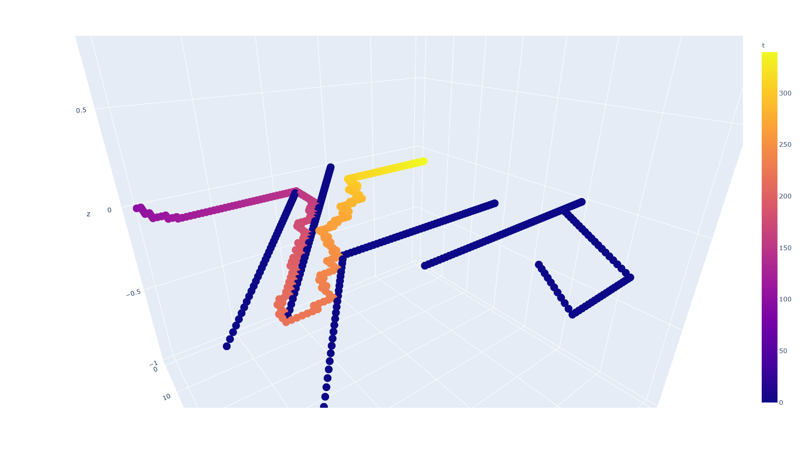
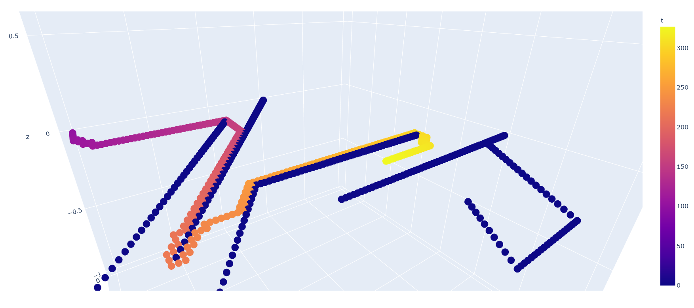
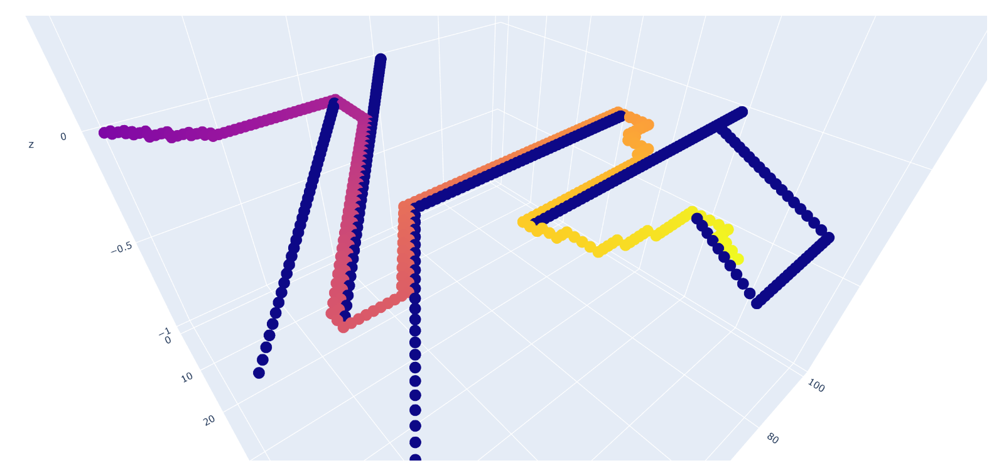

# Modeling_and_Simulation2021

## 2021.4 建模与仿真 - 使用A*算法的最短路径优化设计

**使用python实现**

**Author: GitHub@laorange**

**开源授权协议: AGPL-3.0 License**

示例中，

+ 地图大小为 100 × 100 × 100
+ 起点为 (10, 10, 10)
+ 终点为 (80, 80, 80)

+ 障碍物设置为

```python
    if y < x - 30 or z < y - 30 or x < z - 30:
        print("这是障碍物")
```

+ 效果图：


> 以上图片为浏览器打开demo.html的截图

------

4.13晚 更新

新增功能：2D/3D选择，路径模式/扫描模式

已解决：死胡同会卡死的bug

未解决：死胡同拐出处并非最短路径的问题


-----

4.14 更新：

已解决：死胡同拐出处并非最短路径的问题

新增：时间统计 & 进度显示


+ (0, 0) → (10, 90) : 用时40.92秒



+ (0, 0) → (45, 60) : 用时125.33秒



```
self.f = 0.99 * self.g + self.h

用时: 126.51秒
```

+ (0, 0) → (66, 56) : 用时612.42秒



------

修复问题：初始点未加入到closed_points和computed_points中

计算速度极大提升(原因不详)

上图10分钟出的结果，仅用了28.95秒

