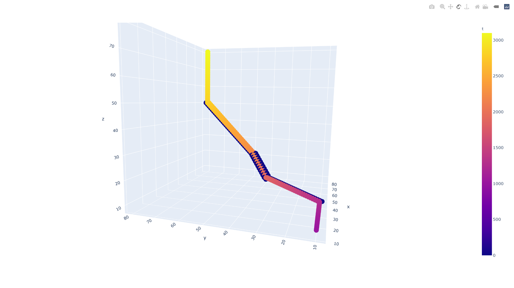
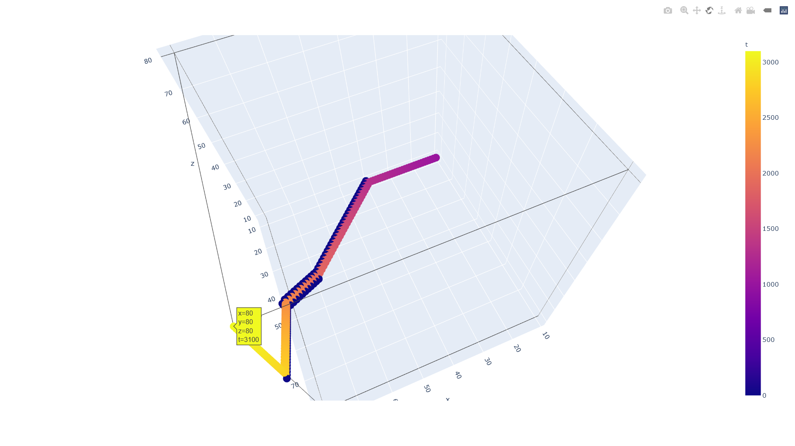
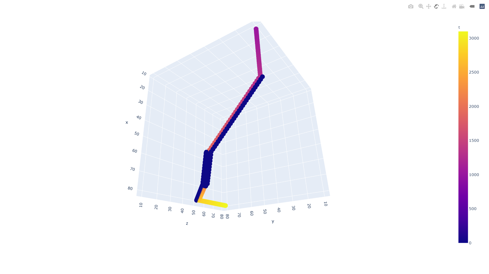
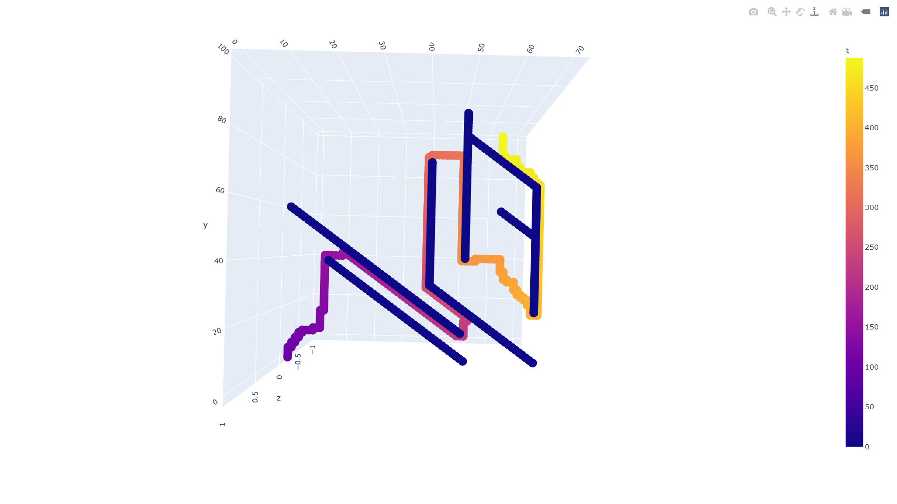
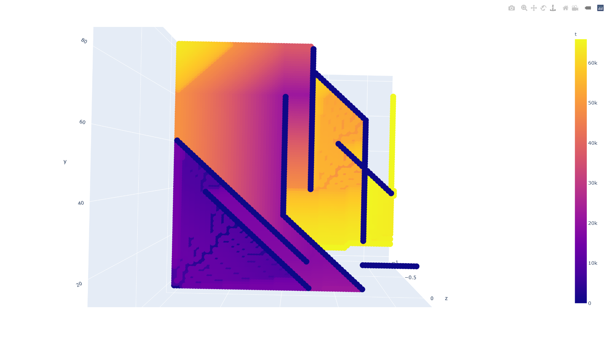
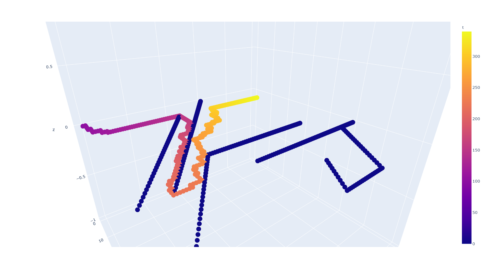
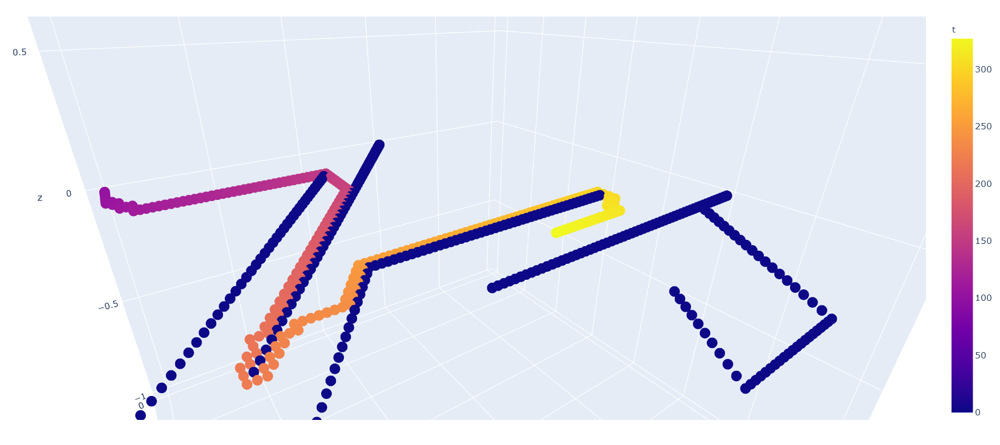
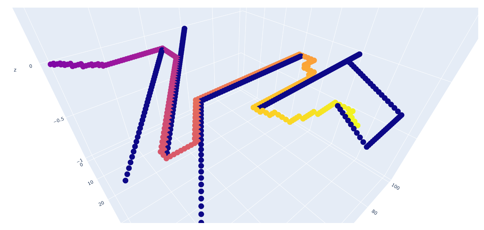
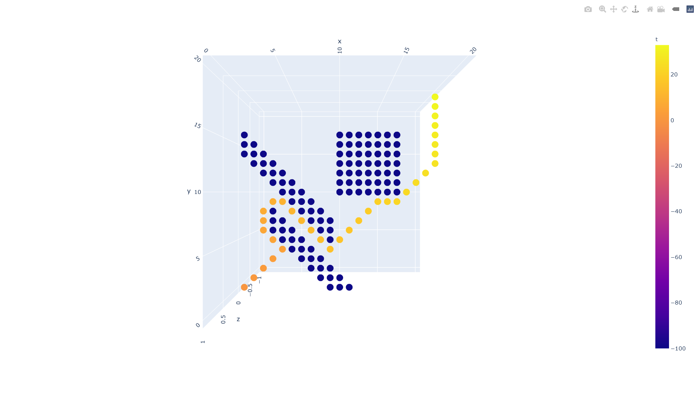

# Modeling_and_Simulation2021

# 2021.4 建模与仿真 - 使用A*算法的最短路径优化设计


## v1.0  

4.13 下午更新

示例中，

+ 地图大小为 100 × 100 × 100
+ 起点为 (10, 10, 10)
+ 终点为 (80, 80, 80)

+ 障碍物设置为

```python
    if y < x - 30 or z < y - 30 or x < z - 30:
        print("这是障碍物")
```

+ 效果图：







> 以上图片为浏览器打开demo.html的截图

------

## v1.1

4.13晚 更新

新增功能：2D/3D选择，路径模式/扫描模式

已解决：死胡同会卡死的bug

未解决：死胡同拐出处并非最短路径的问题





-----

## v1.2

4.14 更新：

已解决：死胡同拐出处并非最短路径的问题

新增：时间统计 & 进度显示


+ (0, 0) → (10, 90) : 用时40.92秒



+ (0, 0) → (45, 60) : 用时125.33秒



```
self.f = 0.99 * self.g + self.h

用时: 126.51秒
```

+ (0, 0) → (66, 56) : 用时612.42秒



------

## v1.3

修复问题：初始点未加入到closed_points和computed_points中

计算速度极大提升(原因不详)

上图10分钟出的结果，仅用了28.95秒

## v1.4

### 2维情况

(0, 0) → (80, 80) : 用时 43.73秒

### 3维情况

(0, 0, 0) → (80, 80, 80) : 用时 570.03秒

## v1.5

优化move方法

### 2维情况

(0, 0) → (80, 80) : 用时 43.03秒

#### 障碍物布局

```python
if x > 10 and y == 50 - x:
    OBSTACLE = True
if x < 50 and y == 60 - x:
    OBSTACLE = True
if x > 40 and y == 70 - x:
    OBSTACLE = True
if x == 50 and y > 40:
    OBSTACLE = True
if x == 40 and 30 <= y < 80:
    OBSTACLE = True
if 60 <= x <= 70 and y == 120 - x:
    OBSTACLE = True
if 50 <= x <= 70 and y == 140 - x:
    OBSTACLE = True
if x == 70 and 50 <= y <= 70:
    OBSTACLE = True
```

### 3维情况

(0, 0, 0) → (80, 80, 80) : 用时 532.22秒

#### 障碍物布局

```python
if y == 20 - x and z < 60:
    OBSTACLE = True
if y == 60 - x and 70 <= z <= 90:
    OBSTACLE = True
if x + y + z == 160 and 40 <= x <= 60 and 40 <= y <= 60 and 40 <= z <= 80:
    OBSTACLE = True
```

## v1.6

新增 斜向移动

## v1.7

使用argparse输入参数

减小默认地图大小

20 × 20 , 下图的识别仅需0.15秒



## v1.8

更正对角线模式下，g和h的计算方法

优化remove方法

## v1.9

1. 显著提升检测速度

   原本2d (0, 0) → (80, 80) : 用时 43.03秒 → 10.2314秒(v1.9)

   原本3d (0, 0, 0) → (80, 80, 80) : 用时 532.22秒 → 13.6530秒(v1.9)

2. 解决斜线模式穿墙的问题

3. 斜线模式成为默认模式

4. 默认地图大小恢复为100×100